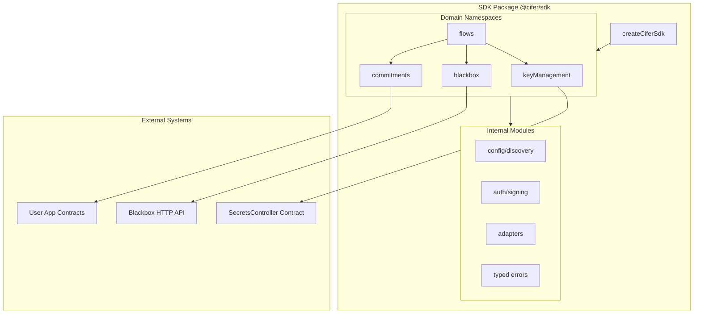

# CIFER SDK Implementation Plan

## Architecture Overview



## Package Structure

```
packages/sdk/
├── src/
│   ├── index.ts                     # Main entry + factory
│   ├── types/
│   │   ├── index.ts                 # Re-exports
│   │   ├── config.ts                # SDK config types
│   │   ├── adapters.ts              # SignerAdapter, ReadClient interfaces
│   │   ├── tx-intent.ts             # TxIntent type
│   │   └── common.ts                # Shared types
│   ├── internal/
│   │   ├── config/
│   │   │   ├── discovery.ts         # /healthz fetching + caching
│   │   │   └── resolver.ts          # Chain config resolution
│   │   ├── auth/
│   │   │   ├── data-string.ts       # Underscore-delimited builders
│   │   │   ├── block-freshness.ts   # Fresh block fetch + retry
│   │   │   └── signer.ts            # signDataString helper
│   │   ├── adapters/
│   │   │   ├── eip1193-signer.ts    # Eip1193SignerAdapter
│   │   │   └── rpc-read-client.ts   # RpcReadClient
│   │   ├── abi/
│   │   │   ├── secrets-controller.ts # Bundled ABI
│   │   │   └── cifer-encrypted.ts    # Minimal ICiferEncrypted ABI
│   │   └── errors/
│   │       └── index.ts             # All typed errors
│   ├── keyManagement/
│   │   ├── index.ts                 # Namespace export
│   │   ├── reads.ts                 # getSecret, getSecretsByWallet, etc.
│   │   ├── tx-builders.ts           # buildCreateSecretTx, buildSetDelegateTx, etc.
│   │   └── events.ts                # parseSecretCreatedLog, parseSecretSyncedLog
│   ├── blackbox/
│   │   ├── index.ts                 # Namespace with payload, files, jobs
│   │   ├── payload.ts               # encryptPayload, decryptPayload
│   │   ├── files.ts                 # encryptFile, decryptFile, decryptExistingFile
│   │   └── jobs.ts                  # getStatus, download, delete, list, dataConsumption
│   ├── commitments/
│   │   ├── index.ts                 # Namespace export
│   │   ├── metadata.ts              # getCIFERMetadata, ciferDataExists, constants
│   │   ├── logs.ts                  # fetchCommitmentFromLogs
│   │   ├── integrity.ts             # verifyCommitmentIntegrity
│   │   └── tx-builders.ts           # buildStoreCommitmentTx (requires user ABI)
│   └── flows/
│       ├── index.ts                 # Namespace export
│       ├── types.ts                 # FlowContext, FlowStep, ExecutionCallbacks
│       ├── create-secret.ts         # createSecretAndWaitReady
│       ├── encrypt-commit.ts        # encryptThenPrepareCommitTx
│       ├── decrypt-from-logs.ts     # retrieveFromLogsThenDecrypt
│       └── file-jobs.ts             # encryptFileJobFlow, decryptFileJobFlow
├── examples/
│   ├── nextjs-eip1193/              # Browser example
│   └── node-rpc/                    # Node.js example
├── tests/
├── package.json
├── tsconfig.json
└── README.md
```

## Core Interfaces

### Adapter Interfaces

```typescript
// SignerAdapter - wallet abstraction
interface SignerAdapter {
  getAddress(): Promise<string>;
  signMessage(message: string): Promise<string>; // EIP-191 personal_sign
  sendTransaction?(txRequest: TxIntent): Promise<{ hash: string }>; // opt-in
}

// ReadClient - RPC abstraction
interface ReadClient {
  getBlockNumber(chainId: number): Promise<number>;
  getLogs(chainId: number, filter: LogFilter): Promise<Log[]>;
  call?(chainId: number, callRequest: CallRequest): Promise<string>;
}

// TxIntent - library-neutral tx output
interface TxIntent {
  chainId: number;
  to: string;
  data: string;
  value?: bigint;
}
```

## Implementation Details by Domain

### 1. Internal: Config + Discovery

- `discover(blackboxUrl)` - calls `/healthz`, returns normalized `DiscoveryResult`
- `resolveChain(chainId, discovery, overrides?)` - merges to get `{ rpcUrl, wsUrl, secretsControllerAddress }`
- Caches discovery result with TTL

### 2. Internal: Auth Module

- `buildDataString(parts: string[])` - joins with underscores
- `getFreshBlockNumber(chainId, readClient)` - fetches current block
- `signDataString(data, signer)` - returns `{ data, signature }`
- `withBlockFreshRetry(fn, maxRetries)` - wraps calls with retry on stale-window errors

### 3. keyManagement Namespace

**Reads** (use SecretsController ABI):

- `getSecret(secretId)` → full SecretState
- `getSecretCreationFee()` → bigint
- `getSecretsByWallet(address)` → { owned: number[], delegated: number[] }
- `getSecretsCountByWallet(address)` → counts

**TX Builders** (return TxIntent):

- `buildCreateSecretTx({ chainId, controllerAddress, fee })` → TxIntent
- `buildSetDelegateTx({ chainId, controllerAddress, secretId, newDelegate })`
- `buildTransferSecretTx({ chainId, controllerAddress, secretId, newOwner })`
- `buildRemoveDelegationTx({ ... })` (setDelegate with zero address)

**Event Parsers**:

- `parseSecretCreatedLog(log)` → { secretId, owner, secretType }
- `parseSecretSyncedLog(log)` → { secretId, clusterId, publicKeyCid }

### 4. blackbox Namespace

**blackbox.payload**:

- `encryptPayload({ chainId, secretId, plaintext, signer, readClient, blackboxUrl, outputFormat? })`
- `decryptPayload({ chainId, secretId, encryptedMessage, cifer, signer, readClient, blackboxUrl, inputFormat? })`

**blackbox.files**:

- `encryptFile({ chainId, secretId, file, signer, readClient, blackboxUrl })` → jobId
- `decryptFile({ chainId, secretId, file, signer, readClient, blackboxUrl })` → jobId
- `decryptExistingFile({ chainId, secretId, encryptJobId, signer, readClient, blackboxUrl })` → jobId

**blackbox.jobs**:

- `getStatus(jobId, blackboxUrl)` → JobStatus (no auth)
- `download(jobId, { chainId, secretId, signer?, readClient?, blackboxUrl })` → Blob/Buffer
- `delete(jobId, { chainId, secretId, signer, readClient, blackboxUrl })`
- `list({ chainId, signer, readClient, blackboxUrl, includeExpired? })` → Job[]
- `dataConsumption({ chainId, signer, readClient, blackboxUrl })` → usage stats

### 5. commitments Namespace

**Mode A - Interface-driven** (uses bundled ICiferEncrypted ABI):

- `getCIFERMetadata({ chainId, contractAddress, dataId, readClient })`
- `ciferDataExists({ chainId, contractAddress, dataId, readClient })`
- `CIFER_ENVELOPE_BYTES`, `MAX_PAYLOAD_BYTES` constants

**Mode B - User-supplied ABI**:

- `createCommitmentsClient({ contractAddress, abi })` → client with typed methods

**Log Retrieval**:

- `fetchCommitmentFromLogs({ chainId, contractAddress, dataId, storedAtBlock, readClient })`

Returns `{ cifer, encryptedMessage, ciferHash, encryptedMessageHash }`

**Integrity**:

- `verifyCommitmentIntegrity({ cifer, encryptedMessage, ciferHash, encryptedMessageHash })`

**TX Builder** (requires user ABI with store method):

- `buildStoreCommitmentTx({ contractAddress, abi, method, key, secretId, cifer, encryptedMessage })`

### 6. flows Namespace

Flows accept `FlowContext` with callbacks:

```typescript
interface FlowContext {
  signer: SignerAdapter;
  readClient: ReadClient;
  blackboxUrl: string;
  chainId: number;
  // Execution callbacks (for execute mode)
  txExecutor?: (intent: TxIntent) => Promise<{ hash: string; waitReceipt: () => Promise<Receipt> }>;
  pollingStrategy?: { intervalMs: number; maxAttempts: number };
  logger?: (msg: string) => void;
  abortSignal?: AbortSignal;
}
```

**Flows**:

- `createSecretAndWaitReady(ctx)` - creates secret, polls until synced
- `encryptThenPrepareCommitTx(ctx, { secretId, plaintext, key, commitmentContract, abi?, method? })`
- `retrieveFromLogsThenDecrypt(ctx, { secretId, dataId, commitmentContract, storedAtBlock })`
- `encryptFileJobFlow(ctx, { secretId, file })` - upload, poll, download
- `decryptFileJobFlow(ctx, { secretId, file })`
- `decryptExistingFileJobFlow(ctx, { secretId, encryptJobId })`

Each flow supports **plan mode** (returns steps) and **execute mode** (runs with callbacks).

## Key Files Reference

- [CiferSecretsControllerMultichainABI.json](docs/CiferSecretsControllerMultichainABI.json) - bundle into SDK for keyManagement
- [ICiferEncrypted.sol](docs/ICiferEncrypted.sol) - derive minimal ABI fragment for commitments
- Blackbox data string formats from [blackbox-info-for-sdk.md](docs/blackbox-info-for-sdk.md):
  - encrypt: `chainId_secretId_signer_blockNumber_plainText`
  - decrypt: `chainId_secretId_signer_blockNumber_encryptedMessage`
  - file ops: `chainId_secretId_signer_blockNumber`
  - job download: `chainId_secretId_signer_blockNumber_jobId_download`
  - job delete: `chainId_secretId_signer_blockNumber_jobId_delete`

## Build Configuration

- TypeScript with strict mode
- Output: ESM primary, CJS secondary via dual package exports
- Target: ES2020 (async/await, BigInt)
- No runtime dependencies on wallet libraries (ethers, viem, wagmi, thirdweb)
- Peer dependency: none required; adapters work with any EIP-1193 provider

## Testing Strategy

1. **auth.test.ts** - data string construction, signature format
2. **block-freshness.test.ts** - retry logic on stale-window errors
3. **jobs-state-machine.test.ts** - polling transitions
4. **commitments-decode.test.ts** - log decoding with minimal ABI

## Example Apps

1. **Next.js + EIP-1193** - browser wallet integration (MetaMask/WalletConnect style)
2. **Node.js + RPC** - server-side with external tx executor stub