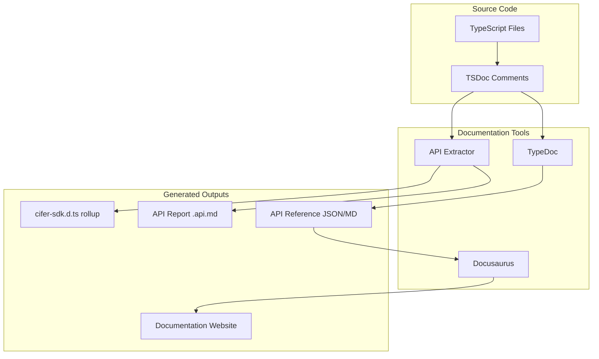

# Documentation Pipeline Integration Plan

## Pipeline Architecture



## Phase 1: TSDoc Comment Enhancement

Update all source files with proper TSDoc syntax for consistent documentation. The SDK already has JSDoc-style comments; we'll enhance them with TSDoc-specific tags.

**Key Tags to Add:**

- `@param` - Parameter descriptions with types
- `@returns` - Return value descriptions
- `@throws` - Exception documentation
- `@example` - Code examples (already present, will standardize)
- `@remarks` - Additional implementation details
- `@public`, `@internal`, `@beta` - Release tags for API visibility
- `@packageDocumentation` - Package-level documentation (already in [`src/index.ts`](src/index.ts))

**Files to Update (priority order):**

1. Public types: [`src/types/adapters.ts`](src/types/adapters.ts), [`src/types/common.ts`](src/types/common.ts), [`src/types/config.ts`](src/types/config.ts)
2. Public namespaces: [`src/keyManagement/`](src/keyManagement/), [`src/blackbox/`](src/blackbox/), [`src/commitments/`](src/commitments/), [`src/flows/`](src/flows/)
3. Internal modules (marked `@internal`): [`src/internal/`](src/internal/)

## Phase 2: API Extractor Setup

Configure API Extractor to validate the public API surface and generate rollup declarations.

**New Files:**

- `api-extractor.json` - Main configuration
- `etc/cifer-sdk.api.md` - Generated API report (tracked in git for PR reviews)
- `dist/cifer-sdk.d.ts` - Bundled type declarations

**Configuration Highlights:**

```json
{
  "mainEntryPointFilePath": "./dist/types/index.d.ts",
  "apiReport": { "enabled": true, "reportFolder": "./etc" },
  "docModel": { "enabled": true, "apiJsonFilePath": "./temp/cifer-sdk.api.json" },
  "dtsRollup": { "enabled": true, "untrimmedFilePath": "./dist/cifer-sdk.d.ts" }
}
```

## Phase 3: TypeDoc Configuration

Set up TypeDoc to generate API reference documentation from TSDoc comments.

**New Files:**

- `typedoc.json` - TypeDoc configuration

**Configuration:**

- Output format: Markdown (for Docusaurus compatibility)
- Include: Public API + Internal modules (with `@internal` tag filtering)
- Output directory: `docs-site/docs/api/`

## Phase 4: Docusaurus Site Setup

Create a documentation website with guides and auto-generated API reference.

**Directory Structure:**

```
docs-site/
├── docusaurus.config.js
├── package.json
├── sidebars.js
├── docs/
│   ├── intro.md
│   ├── getting-started/
│   │   ├── installation.md
│   │   ├── quick-start.md
│   │   └── concepts.md
│   ├── guides/
│   │   ├── key-management.md
│   │   ├── encryption.md
│   │   ├── commitments.md
│   │   └── flows.md
│   └── api/                    (auto-generated by TypeDoc)
│       ├── index.md
│       └── ...
├── static/
└── src/
```

## Phase 5: Build Scripts Integration

Add npm scripts to [`package.json`](package.json) for the documentation workflow.

**New Scripts:**

```json
{
  "scripts": {
    "docs:tsdoc-check": "api-extractor run --local --verbose",
    "docs:api-report": "api-extractor run --local",
    "docs:typedoc": "typedoc",
    "docs:build": "npm run docs:api-report && npm run docs:typedoc && cd docs-site && npm run build",
    "docs:serve": "cd docs-site && npm start"
  }
}
```

## Dependencies to Install

**Root package.json (devDependencies):**

- `@microsoft/api-extractor` - API validation and .d.ts rollup
- `typedoc` - API reference generation
- `typedoc-plugin-markdown` - Markdown output for Docusaurus

**docs-site/package.json:**

- `@docusaurus/core`
- `@docusaurus/preset-classic`

## File Changes Summary

| Action | Path | Description |

|--------|------|-------------|

| Create | `api-extractor.json` | API Extractor configuration |

| Create | `typedoc.json` | TypeDoc configuration |

| Create | `docs-site/` | Docusaurus site with config and initial docs |

| Create | `etc/` | Directory for API reports |

| Update | `package.json` | Add devDependencies and scripts |

| Update | `tsconfig.json` | Ensure `declarationMap: true` for source links |

| Update | All `src/**/*.ts` | Enhance TSDoc comments with proper tags |

## Example TSDoc Enhancement

Current style in [`src/blackbox/payload.ts`](src/blackbox/payload.ts):

```typescript
/**
 * Encrypt a payload using the blackbox API
 * @param params - Encryption parameters
 * @returns Encrypted data (cifer and encryptedMessage)
 */
```

Enhanced TSDoc style:

````typescript
/**
 * Encrypts a payload using the blackbox API.
 *
 * This encrypts short messages (up to ~16KB) using a secret's ML-KEM public key.
 * The result can be stored on-chain as an encrypted commitment.
 *
 * @param params - The encryption parameters including chainId, secretId, and plaintext
 * @returns A promise resolving to the encrypted data containing `cifer` and `encryptedMessage`
 *
 * @throws {@link BlackboxError} When the blackbox API call fails
 * @throws {@link AuthError} When signature verification fails
 * @throws {@link BlockStaleError} When the block number is outside the freshness window
 *
 * @example
 * ```typescript
 * const result = await encryptPayload({
 *   chainId: 752025,
 *   secretId: 123n,
 *   plaintext: 'My secret message',
 *   signer,
 *   readClient,
 *   blackboxUrl: 'https://blackbox.cifer.network',
 * });
 * ```
 *
 * @public
 */
````