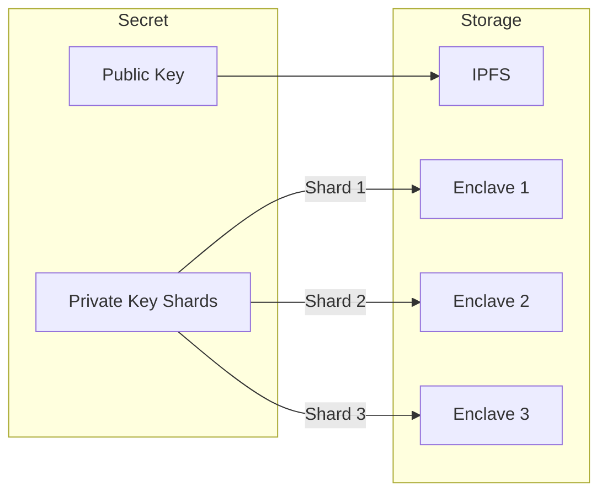
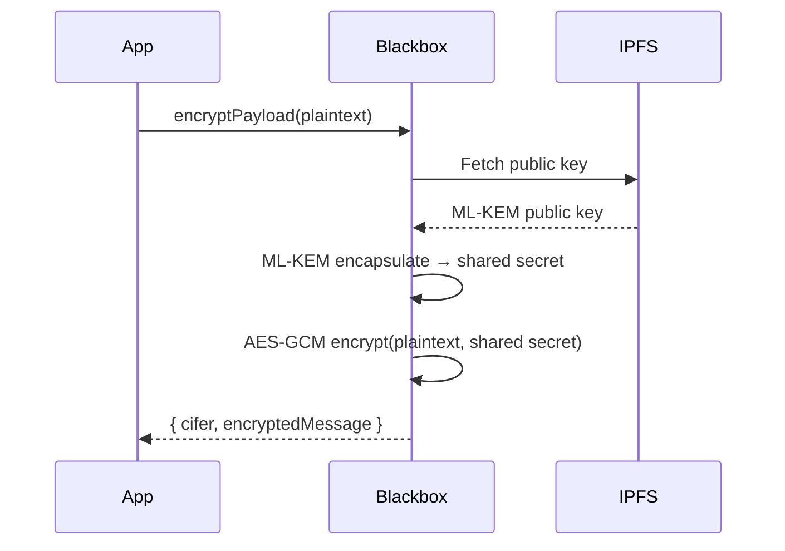
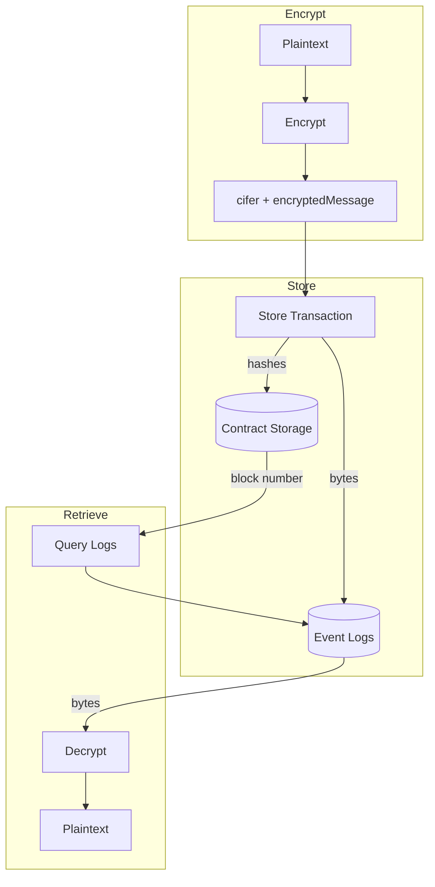

# Core Concepts

Understanding the fundamental concepts of CIFER will help you build secure applications.

## Secrets

A **secret** is the core primitive in CIFER. Each secret represents an ML-KEM-768 key pair where:

- The **public key** is stored on IPFS and used for encryption
- The **private key** is split across an enclave cluster using threshold cryptography



### Secret Lifecycle

1. **Creation**: User calls `createSecret()` on the SecretsController
2. **Syncing**: Enclave cluster generates keys and stores shards
3. **Ready**: Secret is ready when `isSyncing = false`
4. **Usage**: Owner/delegate can encrypt and decrypt

### Secret State

```typescript
interface SecretState {
  owner: Address;      // Can transfer, delegate, and decrypt
  delegate: Address;   // Can decrypt (zero address if none)
  isSyncing: boolean;  // True while key generation is in progress
  clusterId: number;   // Which enclave cluster holds the shards
  secretType: number;  // 1 = ML-KEM-768 (standard)
  publicKeyCid: string; // IPFS CID of the public key
}
```

## Authorization Model

CIFER uses a simple two-role authorization model:

| Role | Capabilities |
|------|-------------|
| **Owner** | Encrypt, decrypt, transfer ownership, set delegate |
| **Delegate** | Decrypt only (cannot encrypt or modify secret) |

### Setting a Delegate

```typescript
const txIntent = keyManagement.buildSetDelegateTx({
  chainId,
  controllerAddress,
  secretId: 123n,
  newDelegate: '0xDelegateAddress...',
});
```

### Removing a Delegate

```typescript
const txIntent = keyManagement.buildRemoveDelegationTx({
  chainId,
  controllerAddress,
  secretId: 123n,
});
```

## Encryption Model

CIFER uses hybrid encryption combining:

1. **ML-KEM-768**: Post-quantum key encapsulation (1088-byte ciphertext)
2. **AES-256-GCM**: Symmetric encryption for the actual data



### Output Format

| Field | Size | Description |
|-------|------|-------------|
| `cifer` | 1104 bytes | ML-KEM ciphertext (1088) + AES-GCM tag (16) |
| `encryptedMessage` | Variable | AES-GCM encrypted data (max 16KB) |

## Block Freshness

All blackbox API calls require a **recent block number** in the signed payload. This prevents replay attacks.

```typescript
// The SDK handles this automatically
const dataString = `${chainId}_${secretId}_${signer}_${blockNumber}_${plaintext}`;
const signature = await signer.signMessage(dataString);
```

### Freshness Window

- **Default**: ~100 blocks (~10 minutes on most chains)
- **Automatic retry**: SDK retries with fresh block on stale errors

### Handling Stale Blocks

```typescript
try {
  await blackbox.payload.encryptPayload({ ... });
} catch (error) {
  if (isBlockStaleError(error)) {
    // SDK already retried 3 times - this is a persistent issue
    console.log('Network or RPC issue - block numbers are stale');
  }
}
```

## On-Chain Commitments

Encrypted data can be stored on-chain using the "commitment" pattern:

1. **Storage**: Only hashes are stored on-chain (gas efficient)
2. **Data**: Full encrypted bytes are emitted in events
3. **Retrieval**: Fetch from logs using block number from metadata



### Metadata Structure

```typescript
interface CIFERMetadata {
  secretId: bigint;           // Which secret was used
  storedAtBlock: number;      // Block where data was stored
  ciferHash: Bytes32;         // keccak256(cifer)
  encryptedMessageHash: Bytes32; // keccak256(encryptedMessage)
}
```

## Transaction Intents

The SDK uses the **transaction intent pattern** for all write operations:

```typescript
// SDK returns a description of the transaction
const txIntent = keyManagement.buildCreateSecretTx({
  chainId,
  controllerAddress,
  fee,
});

// You execute it with your preferred method
await wallet.sendTransaction(txIntent);
```

### Benefits

- **No wallet lock-in**: Works with any EIP-1193 provider
- **Full control**: You manage gas, nonce, and timing
- **Easy simulation**: Preview transactions before sending

### TxIntent Structure

```typescript
interface TxIntent {
  chainId: number;  // Target chain
  to: Address;      // Contract address
  data: Hex;        // Encoded calldata
  value?: bigint;   // Native token value (if payable)
}
```

## Discovery

The SDK can automatically fetch chain configuration:

```typescript
const sdk = await createCiferSdk({
  blackboxUrl: 'https://cifer-blackbox.ternoa.dev:3010.network',
});

// Configuration is auto-discovered from /healthz
sdk.getSupportedChainIds(); // [752025, 11155111, ...]
sdk.getControllerAddress(752025); // '0x...'
sdk.getRpcUrl(752025); // 'https://...'
```

### Manual Configuration

For offline or private deployments:

```typescript
const sdk = createCiferSdkSync({
  readClient: myReadClient,
  chainOverrides: {
    752025: {
      rpcUrl: 'https://my-rpc.example.com',
      secretsControllerAddress: '0x...',
    },
  },
});
```

## Debugging & Logging

The SDK **does not log to console by default**. Instead, it throws typed errors that you can catch and handle programmatically.

### Enabling Debug Logging

To see progress messages during SDK operations, pass a `logger` function:

```typescript
const sdk = await createCiferSdk({
  blackboxUrl: 'https://cifer-blackbox.ternoa.dev:3010.network',
  logger: console.log, // Enable debug output
});
```

The logger receives messages like:
- `"Performing discovery..."`
- `"Discovery complete. Supported chains: 752025, 11155111"`
- `"Discovery refreshed"`

### Flow Context Logging

For flows, pass a logger in the context:

```typescript
const ctx = {
  signer,
  readClient,
  blackboxUrl,
  chainId,
  txExecutor,
  logger: (msg) => console.log(`[CIFER] ${msg}`), // Custom formatting
};

const result = await flows.createSecretAndWaitReady(ctx);
```

### Error Information

All SDK errors extend `CiferError` and include:

- **`code`**: Programmatic error code (e.g., `AUTH_ERROR`, `BLACKBOX_ERROR`)
- **`message`**: Human-readable description
- **`cause`**: Original underlying error (for error chaining)
- **Stack trace**: Preserved for debugging

```typescript
try {
  await blackbox.payload.encryptPayload({ ... });
} catch (error) {
  if (isCiferError(error)) {
    console.log('Code:', error.code);
    console.log('Message:', error.message);
    if (error.cause) {
      console.log('Caused by:', error.cause);
    }
  }
}
```

See the [Error Handling](#error-handling) sections in each guide for specific error types.

## Next Steps

- [Key Management Guide](/docs/guides/key-management) - Create and manage secrets
- [Encryption Guide](/docs/guides/encryption) - Encrypt and decrypt data
- [Commitments Guide](/docs/guides/commitments) - Store encrypted data on-chain
