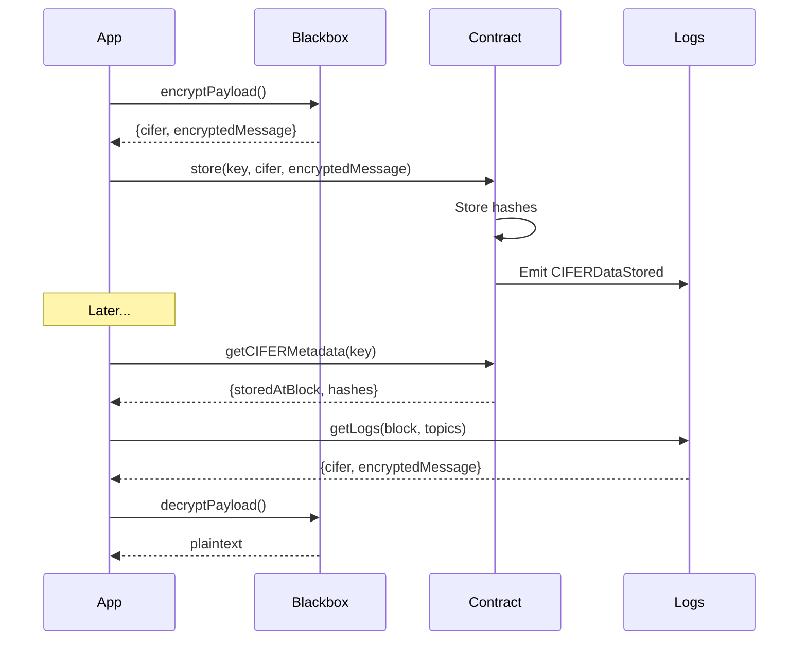

# Commitments Guide

Learn how to store and retrieve encrypted data on-chain.

## Overview

CIFER commitments allow you to store encrypted data on-chain in a gas-efficient manner:

- **Storage**: Only hashes are stored in contract storage
- **Data**: Full encrypted bytes are emitted in events
- **Retrieval**: Fetch from logs using the block number from metadata

## The Commitment Pattern



## Storing Data

### Step 1: Encrypt

```typescript
import { blackbox } from 'cifer-sdk';

const encrypted = await blackbox.payload.encryptPayload({
  chainId: 752025,
  secretId: 123n,
  plaintext: 'My confidential data',
  signer,
  readClient: sdk.readClient,
  blackboxUrl: sdk.blackboxUrl,
  outputFormat: 'hex',
});
```

### Step 2: Validate

```typescript
import { commitments } from 'cifer-sdk';

// Validate sizes before storing
commitments.validateForStorage(
  encrypted.cifer,
  encrypted.encryptedMessage
);
```

### Step 3: Build Transaction

```typescript
const txIntent = commitments.buildStoreCommitmentTx({
  chainId: 752025,
  contractAddress: '0xYourContract...',
  storeFunction: {
    type: 'function',
    name: 'store',
    inputs: [
      { name: 'key', type: 'bytes32' },
      { name: 'encryptedMessage', type: 'bytes' },
      { name: 'cifer', type: 'bytes' },
    ],
  },
  args: {
    key: dataKey, // bytes32
    secretId: 123n,
    encryptedMessage: encrypted.encryptedMessage,
    cifer: encrypted.cifer,
  },
});

await wallet.sendTransaction(txIntent);
```

## Retrieving Data

### Step 1: Get Metadata

```typescript
const metadata = await commitments.getCIFERMetadata({
  chainId: 752025,
  contractAddress: '0xYourContract...',
  readClient: sdk.readClient,
}, dataKey);

console.log('Secret ID:', metadata.secretId);
console.log('Stored at block:', metadata.storedAtBlock);
```

### Step 2: Fetch from Logs

```typescript
const data = await commitments.fetchCommitmentFromLogs({
  chainId: 752025,
  contractAddress: '0xYourContract...',
  dataId: dataKey,
  storedAtBlock: metadata.storedAtBlock,
  readClient: sdk.readClient,
});
```

### Step 3: Verify Integrity

```typescript
// Verify hashes match
commitments.assertCommitmentIntegrity(data, metadata);
```

### Step 4: Decrypt

```typescript
const decrypted = await blackbox.payload.decryptPayload({
  chainId: 752025,
  secretId: metadata.secretId,
  encryptedMessage: data.encryptedMessage,
  cifer: data.cifer,
  signer,
  readClient: sdk.readClient,
  blackboxUrl: sdk.blackboxUrl,
  inputFormat: 'hex',
});

console.log('Decrypted:', decrypted.decryptedMessage);
```

## Using the Flow

For a simpler experience:

### Encrypt and Prepare Transaction

```typescript
import { flows } from 'cifer-sdk';

const result = await flows.encryptThenPrepareCommitTx(ctx, {
  secretId: 123n,
  plaintext: 'My data',
  key: dataKey,
  commitmentContract: '0xYourContract...',
});

if (result.success) {
  // Execute the transaction
  await wallet.sendTransaction(result.data.txIntent);
}
```

### Retrieve and Decrypt

```typescript
const result = await flows.retrieveFromLogsThenDecrypt(ctx, {
  secretId: 123n,
  dataId: dataKey,
  commitmentContract: '0xYourContract...',
});

if (result.success) {
  console.log('Decrypted:', result.data.decryptedMessage);
}
```

## Reading Metadata

### Check Existence

```typescript
const exists = await commitments.ciferDataExists({
  chainId: 752025,
  contractAddress: '0xYourContract...',
  readClient: sdk.readClient,
}, dataKey);

if (exists) {
  // Data is stored
}
```

### Get Metadata

```typescript
const metadata = await commitments.getCIFERMetadata({
  chainId: 752025,
  contractAddress: '0xYourContract...',
  readClient: sdk.readClient,
}, dataKey);
```

## Integrity Verification

### Automatic Verification

```typescript
try {
  commitments.assertCommitmentIntegrity(data, metadata);
  console.log('Data integrity verified');
} catch (error) {
  if (error instanceof IntegrityError) {
    console.error('Integrity check failed:', error.field);
  }
}
```

### Manual Verification

```typescript
const result = commitments.verifyCommitmentIntegrity(data, metadata);

console.log('Valid:', result.valid);
console.log('Cifer size:', result.checks.ciferSize);
console.log('Payload size:', result.checks.payloadSize);
console.log('Cifer hash:', result.checks.ciferHash);
```

## Size Limits

| Constraint | Value | Description |
|------------|-------|-------------|
| CIFER envelope | 1104 bytes | Fixed size (ML-KEM + AES-GCM tag) |
| Max payload | 16384 bytes | Maximum encrypted message size |

### Validate Before Storing

```typescript
try {
  commitments.validateForStorage(cifer, encryptedMessage);
} catch (error) {
  if (error instanceof InvalidCiferSizeError) {
    console.error('Cifer must be 1104 bytes');
  } else if (error instanceof PayloadTooLargeError) {
    console.error('Payload exceeds 16KB limit');
  }
}
```

## Contract Integration

### ICiferEncrypted Interface

Your contract should implement the `ICiferEncrypted` interface:

```solidity
interface ICiferEncrypted {
    function getCIFERMetadata(bytes32 dataId) 
        external view returns (
            uint256 secretId,
            uint256 storedAtBlock,
            bytes32 ciferHash,
            bytes32 encryptedMessageHash
        );
    
    function ciferDataExists(bytes32 dataId) 
        external view returns (bool);
}
```

### Using CiferEncryptedBase

Inherit from `CiferEncryptedBase` for built-in functionality:

```solidity
contract MyVault is CiferEncryptedBase {
    function store(
        bytes32 key,
        bytes calldata encryptedMessage,
        bytes calldata cifer
    ) external {
        _storeEncryptedData(key, _getUserSecretId(msg.sender), encryptedMessage, cifer);
    }
}
```

## Error Handling

```typescript
import {
  CommitmentsError,
  CommitmentNotFoundError,
  IntegrityError,
  InvalidCiferSizeError,
  PayloadTooLargeError,
  isCiferError,
} from 'cifer-sdk';

try {
  const data = await commitments.fetchCommitmentFromLogs({ ... });
} catch (error) {
  if (error instanceof CommitmentNotFoundError) {
    console.log('No data found for key:', error.dataId);
  } else if (error instanceof IntegrityError) {
    console.log('Data corrupted:', error.field);
    console.log('Expected:', error.expectedHash);
    console.log('Actual:', error.actualHash);
  }
  
  // Access underlying error for RPC/parsing issues
  if (isCiferError(error) && error.cause) {
    console.log('Underlying error:', error.cause);
  }
}
```

:::tip Debug Logging
The SDK doesn't log by default. Enable debug output when troubleshooting:

```typescript
const sdk = await createCiferSdk({
  blackboxUrl: 'https://blackbox.cifer.network',
  logger: console.log,
});
```

See [Debugging & Logging](/docs/getting-started/concepts#debugging--logging) for more details.
:::

## Best Practices

1. **Always verify integrity** - Check hashes before decryption
2. **Handle missing data** - Check `ciferDataExists` before fetching
3. **Use retry logic** - Log queries may fail due to RPC issues
4. **Cache metadata** - Store block numbers to avoid redundant queries
5. **Batch operations** - Fetch multiple logs in a single query when possible
