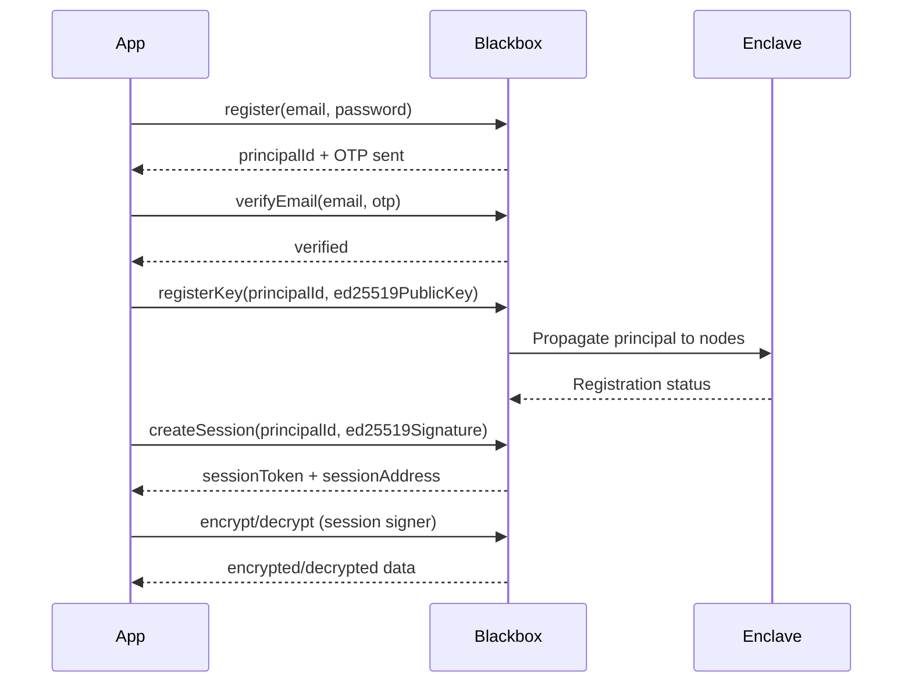

# Web2 Guide (Advanced)

:::tip New to Web2 mode?
For a quick introduction, see the [Quick Start (Web2)](/docs/getting-started/quick-start-web2) to get up and running in 5 minutes.
:::

Learn how to use CIFER encryption with email-based authentication instead of blockchain wallets.

## Overview

The `web2` namespace enables email + password registration for CIFER, removing the requirement for a blockchain wallet. This is ideal for:

- Server-side applications and backend services
- Traditional web apps that don't use wallets
- TEE (Trusted Execution Environment) integrations
- Onboarding users who aren't familiar with Web3

Under the hood, Web2 mode uses the same blackbox encryption pipeline as Web3 mode, but replaces wallet-based signing with **session-based signing** using ephemeral EOA keypairs.



### Web2 vs Web3

| Feature | Web3 | Web2 |
|---------|------|------|
| **Auth** | EIP-1193 wallet (MetaMask, etc.) | Email + password + Ed25519 key |
| **Chain ID** | Real chain ID (e.g. 752025) | `WEB2_CHAIN_ID = -1` (sentinel) |
| **Block freshness** | RPC `eth_blockNumber` | `Date.now()` (millisecond timestamp) |
| **Signer** | Wallet `personal_sign` | Session EOA `personal_sign` |
| **Secret creation** | On-chain transaction | `POST /web2/secret` API call |

## Web2 Client (Recommended)

The `web2.createClient()` factory creates a client that stores your `session`, `blackboxUrl`, and `readClient` internally. Once a session is created, all subsequent calls use it automatically — no need to pass `session` and `blackboxUrl` on every call.

```typescript
import { createCiferSdk, web2 } from 'cifer-sdk';

const sdk = await createCiferSdk({ blackboxUrl: 'https://cifer-blackbox.ternoa.dev:3010' });

// Create a client with stored defaults
const client = web2.createClient({
  blackboxUrl: sdk.blackboxUrl,
  readClient: sdk.readClient,
});

// Session is auto-stored after creation
await client.createManagedSession({
  principalId: 'your-principal-uuid',
  ed25519Signer: myEd25519Signer,
});

// All subsequent calls use the stored session automatically
const secret = await client.createSecret();
const encrypted = await client.payload.encryptPayload({
  secretId: secret.secretId,
  plaintext: 'Hello Web2!',
});
```

### Per-Call Overrides

Every client method accepts optional overrides for `session`, `blackboxUrl`, and `readClient`:

```typescript
// Use a different session for this one call
const secret = await client.createSecret({
  session: anotherSession,
});

// Override blackboxUrl for this call
const secret2 = await client.createSecret({
  blackboxUrl: 'https://other-blackbox.example.com:3010',
});
```

### Manual Session Management

You can also set the session manually:

```typescript
// Set session from external source
const session = web2.session.useExistingSessionKey({
  sessionPrivateKey: '0xabc123...',
});
client.setSession(session);
```

:::tip Stateless API
The original stateless `web2.*` functions (`web2.secret.createSecret()`, `web2.blackbox.payload.encryptPayload()`, etc.) remain available. Use them when you need full control or are managing multiple sessions. All examples below use both styles.
:::

## Registration Flow

Registration is a three-phase process.

### Phase 1: Register with Email

```typescript
import { web2 } from 'cifer-sdk';

const result = await web2.auth.register({
  email: 'user@example.com',
  password: 'securePassword123',
  blackboxUrl: 'https://cifer-blackbox.ternoa.dev:3010',
});

console.log('Principal ID:', result.principalId);
// An OTP has been sent to the email
```

### Phase 2: Verify Email

```typescript
const verified = await web2.auth.verifyEmail({
  email: 'user@example.com',
  otp: '123456', // OTP from email
  blackboxUrl: 'https://cifer-blackbox.ternoa.dev:3010',
});

console.log('Verified:', verified.emailVerified);
```

:::tip Resend OTP
If the OTP expires or wasn't received, call `web2.auth.resendOtp()`. There is a 60-second cooldown between requests.
:::

### Phase 3: Register Ed25519 Key

After verification, register an Ed25519 public key. This key is propagated to all enclave cluster nodes and is used to authenticate session creation.

```typescript
const keyResult = await web2.auth.registerKey({
  principalId: result.principalId,
  password: 'securePassword123',
  ed25519Signer: myEd25519Signer,
  blackboxUrl: 'https://cifer-blackbox.ternoa.dev:3010',
});

if (keyResult.nodeRegistrationStatus !== 'complete') {
  // Some nodes failed -- retry
  await web2.auth.retryNodeRegistration({
    principalId: keyResult.principalId,
    blackboxUrl: 'https://cifer-blackbox.ternoa.dev:3010',
  });
}
```

## Ed25519 Signer Setup

The SDK uses a **bring-your-own-library** pattern for Ed25519 signing. You provide an object implementing the `Ed25519Signer` interface:

```typescript
interface Ed25519Signer {
  sign(message: Uint8Array): Promise<Uint8Array>;
  getPublicKey(): Uint8Array;
}
```

### Using @noble/ed25519

```bash
npm install @noble/ed25519
```

```typescript
import * as ed from '@noble/ed25519';

// Generate or load your Ed25519 private key
const privateKey = ed.utils.randomPrivateKey();
const publicKey = await ed.getPublicKeyAsync(privateKey);

const ed25519Signer = {
  async sign(message: Uint8Array): Promise<Uint8Array> {
    return ed.signAsync(message, privateKey);
  },
  getPublicKey(): Uint8Array {
    return publicKey;
  },
};
```

### Using Node.js crypto

```typescript
import { createPrivateKey, createPublicKey, sign } from 'crypto';

// Generate an Ed25519 keypair
const { privateKey, publicKey } = crypto.generateKeyPairSync('ed25519');

const ed25519Signer = {
  async sign(message: Uint8Array): Promise<Uint8Array> {
    const sig = sign(null, Buffer.from(message), privateKey);
    return new Uint8Array(sig);
  },
  getPublicKey(): Uint8Array {
    // Export raw 32-byte public key
    const raw = publicKey.export({ type: 'spki', format: 'der' });
    return new Uint8Array(raw.slice(-32));
  },
};
```

## Session Management

Sessions authenticate blackbox API calls. The SDK provides two modes.

### Managed Sessions (Recommended)

The SDK generates an ephemeral EOA keypair, authenticates via your Ed25519 key, and handles renewal automatically.

```typescript
const session = await web2.session.createManagedSession({
  principalId: 'your-principal-uuid',
  ed25519Signer: myEd25519Signer,
  blackboxUrl: 'https://cifer-blackbox.ternoa.dev:3010',
  ttl: 900, // Optional: session TTL in seconds (default: 15 min)
});

console.log('Session address:', session.sessionAddress);
console.log('Expires at:', session.expiresAt);
```

**Key properties of managed sessions:**

- `session.signer` -- The ephemeral EOA signer (used automatically by wrappers)
- `session.ensureValid()` -- Checks expiry with 60s skew, auto-renews if needed
- `session.renew()` -- Force-renew the session
- `session.isManaged` -- Always `true`

### Existing Session Key

For advanced use cases (e.g. TEE web front) where a session was already created externally:

```typescript
const session = web2.session.useExistingSessionKey({
  sessionPrivateKey: '0xabc123...', // Hex-encoded secp256k1 private key
  principalId: 'your-principal-uuid', // Optional
});
```

:::warning Cannot Renew
Sessions created with `useExistingSessionKey` cannot renew. Calling `session.renew()` will throw a `Web2SessionError`. The session must be recreated externally when it expires.
:::

## Creating and Managing Secrets

### Create a Secret

```typescript
const secret = await web2.secret.createSecret({
  session,
  blackboxUrl: 'https://cifer-blackbox.ternoa.dev:3010',
});

console.log('Secret ID:', secret.secretId);
```

### List Secrets

```typescript
const result = await web2.secret.listSecrets({
  session,
  blackboxUrl: 'https://cifer-blackbox.ternoa.dev:3010',
});

for (const s of result.secrets) {
  console.log(`Secret ${s.secretId}: ${s.status}`);
}
```

## Delegates

Allow another principal to decrypt your secrets:

```typescript
// Set a delegate
await web2.delegate.setDelegate({
  session,
  secretId: 42,
  delegatePrincipalId: 'delegate-principal-uuid',
  blackboxUrl: 'https://cifer-blackbox.ternoa.dev:3010',
});

// Remove a delegate (pass empty string)
await web2.delegate.setDelegate({
  session,
  secretId: 42,
  delegatePrincipalId: '',
  blackboxUrl: 'https://cifer-blackbox.ternoa.dev:3010',
});
```

:::tip Finding a Principal ID
Use `web2.principal.getByEmail()` to look up a principal ID by email address:

```typescript
const principal = await web2.principal.getByEmail(
  'colleague@example.com',
  'https://cifer-blackbox.ternoa.dev:3010'
);
console.log('Delegate principal:', principal.principalId);
```
:::

## Permits

Request permits for key rotation, ownership transfer, or delegation:

```typescript
// Key rotation (uses email + password, no session needed)
const rotateResult = await web2.permit.requestPermit({
  action: 'rotate',
  email: 'user@example.com',
  password: 'securePassword123',
  payload: { newPublicKey: '...' },
  blackboxUrl: 'https://cifer-blackbox.ternoa.dev:3010',
});

// Transfer ownership (uses session)
const transferResult = await web2.permit.requestPermit({
  action: 'transfer',
  session,
  secretId: 42,
  payload: { newOwnerPrincipalId: 'new-owner-uuid' },
  blackboxUrl: 'https://cifer-blackbox.ternoa.dev:3010',
});
```

## Encryption and Decryption

The `web2.blackbox` namespace provides session-first wrappers that automatically set `chainId = -1` and use the session signer.

### Payload Encryption

```typescript
// Encrypt
const encrypted = await web2.blackbox.payload.encryptPayload({
  session,
  secretId: 42,
  plaintext: 'My secret message',
  blackboxUrl: 'https://cifer-blackbox.ternoa.dev:3010',
  readClient: sdk.readClient,
});

console.log('Cifer:', encrypted.cifer);
console.log('Encrypted message:', encrypted.encryptedMessage);

// Decrypt
const decrypted = await web2.blackbox.payload.decryptPayload({
  session,
  secretId: 42,
  encryptedMessage: encrypted.encryptedMessage,
  cifer: encrypted.cifer,
  blackboxUrl: 'https://cifer-blackbox.ternoa.dev:3010',
  readClient: sdk.readClient,
});

console.log('Decrypted:', decrypted.decryptedMessage);
```

### File Encryption

```typescript
// Encrypt a file
const job = await web2.blackbox.files.encryptFile({
  session,
  secretId: 42,
  file: myFile,
  blackboxUrl: 'https://cifer-blackbox.ternoa.dev:3010',
  readClient: sdk.readClient,
});

// Poll until complete (no session needed)
const status = await web2.blackbox.jobs.pollUntilComplete(
  job.jobId,
  'https://cifer-blackbox.ternoa.dev:3010',
  {
    onProgress: (job) => console.log(`Progress: ${job.progress}%`),
  }
);

// Download encrypted file (no session needed for encrypt jobs)
const { download } = await import('cifer-sdk/blackbox');
const encryptedBlob = await download(job.jobId, {
  blackboxUrl: 'https://cifer-blackbox.ternoa.dev:3010',
});
```

### File Decryption

```typescript
// Decrypt a file (session needed)
const decryptJob = await web2.blackbox.files.decryptFile({
  session,
  secretId: 42,
  file: encryptedCiferFile,
  blackboxUrl: 'https://cifer-blackbox.ternoa.dev:3010',
  readClient: sdk.readClient,
});

await web2.blackbox.jobs.pollUntilComplete(
  decryptJob.jobId,
  'https://cifer-blackbox.ternoa.dev:3010'
);

// Download decrypted file (session needed for decrypt jobs)
const decryptedBlob = await web2.blackbox.jobs.download(
  decryptJob.jobId,
  {
    session,
    secretId: 42,
    blackboxUrl: 'https://cifer-blackbox.ternoa.dev:3010',
    readClient: sdk.readClient,
  }
);
```

### Job Management

```typescript
// List all jobs
const jobs = await web2.blackbox.jobs.list({
  session,
  blackboxUrl: 'https://cifer-blackbox.ternoa.dev:3010',
  readClient: sdk.readClient,
});

// Delete a job
await web2.blackbox.jobs.deleteJob('job-id', {
  session,
  secretId: 42,
  blackboxUrl: 'https://cifer-blackbox.ternoa.dev:3010',
  readClient: sdk.readClient,
});

// Check data consumption
const usage = await web2.blackbox.jobs.dataConsumption({
  session,
  blackboxUrl: 'https://cifer-blackbox.ternoa.dev:3010',
  readClient: sdk.readClient,
});
```

## Password Reset

```typescript
// Step 1: Request a reset OTP (60s cooldown)
await web2.auth.forgotPassword({
  email: 'user@example.com',
  blackboxUrl: 'https://cifer-blackbox.ternoa.dev:3010',
});

// Step 2: Reset password with the OTP
await web2.auth.resetPassword({
  email: 'user@example.com',
  otp: '654321',
  newPassword: 'newSecurePassword456',
  blackboxUrl: 'https://cifer-blackbox.ternoa.dev:3010',
});
```

## Error Handling

```typescript
import {
  Web2Error,
  Web2SessionError,
  Web2AuthError,
  isWeb2Error,
  isWeb2SessionError,
  isCiferError,
} from 'cifer-sdk';

try {
  await web2.blackbox.payload.encryptPayload({ ... });
} catch (error) {
  if (isWeb2SessionError(error)) {
    // Session expired or cannot be renewed
    console.log('Session error:', error.message);
    // Re-create the session
  } else if (error instanceof Web2AuthError) {
    // Registration, OTP, or password error
    console.log('Auth error:', error.message);
  } else if (isWeb2Error(error)) {
    // Generic Web2 error
    console.log('Web2 error:', error.code, error.message);
  } else if (isCiferError(error)) {
    // Any other CIFER SDK error (blackbox, block stale, etc.)
    console.log('CIFER error:', error.code, error.message);
  }
}
```

## Complete Example

End-to-end Web2 flow from registration to encryption using the Web2 client:

```typescript
import { createCiferSdk, web2 } from 'cifer-sdk';
import * as ed from '@noble/ed25519';

async function web2Example() {
  const blackboxUrl = 'https://cifer-blackbox.ternoa.dev:3010';

  // Initialize SDK + Web2 client
  const sdk = await createCiferSdk({ blackboxUrl });
  const client = web2.createClient({
    blackboxUrl,
    readClient: sdk.readClient,
  });

  // --- Ed25519 key setup ---
  const privateKey = ed.utils.randomPrivateKey();
  const publicKey = await ed.getPublicKeyAsync(privateKey);

  const ed25519Signer = {
    async sign(message: Uint8Array) {
      return ed.signAsync(message, privateKey);
    },
    getPublicKey() {
      return publicKey;
    },
  };

  // --- Registration ---
  const reg = await web2.auth.register({
    email: 'user@example.com',
    password: 'securePassword123',
    blackboxUrl,
  });

  // (User receives OTP via email)
  await web2.auth.verifyEmail({
    email: 'user@example.com',
    otp: '123456',
    blackboxUrl,
  });

  await web2.auth.registerKey({
    principalId: reg.principalId,
    password: 'securePassword123',
    ed25519Signer,
    blackboxUrl,
  });

  // --- Session (auto-stored in client) ---
  await client.createManagedSession({
    principalId: reg.principalId,
    ed25519Signer,
  });

  // --- Create a secret (no session/blackboxUrl needed!) ---
  const secret = await client.createSecret();

  // --- Encrypt ---
  const encrypted = await client.payload.encryptPayload({
    secretId: secret.secretId,
    plaintext: 'Hello from Web2!',
  });

  // --- Decrypt ---
  const decrypted = await client.payload.decryptPayload({
    secretId: secret.secretId,
    encryptedMessage: encrypted.encryptedMessage,
    cifer: encrypted.cifer,
  });

  console.log('Decrypted:', decrypted.decryptedMessage);
  // Output: "Hello from Web2!"
}

web2Example().catch(console.error);
```

## Best Practices

### 1. Use the Web2 Client

Prefer `web2.createClient()` over individual stateless functions. The client stores your session and defaults, reducing boilerplate and the risk of forgetting to pass required parameters.

### 2. Secure Your Ed25519 Key

Store Ed25519 private keys securely (e.g. environment variables, HSMs, or secret managers). Never expose them in client-side code.

### 3. Use Managed Sessions

Prefer `createManagedSession()` over `useExistingSessionKey()` for automatic renewal and simpler lifecycle management.

### 4. Let `ensureValid()` Handle Renewal

The `web2.blackbox.*` wrappers and the Web2 client call `session.ensureValid()` automatically before each request. You don't need to manually check session expiry.

### 5. Handle Node Registration Failures

After `registerKey()`, check `nodeRegistrationStatus`. If it's not `'complete'`, use `retryNodeRegistration()` to retry failed nodes before creating sessions.

### 6. Respect Rate Limits

`resendOtp()` and `forgotPassword()` have a 60-second cooldown. Build appropriate UI feedback for users.
