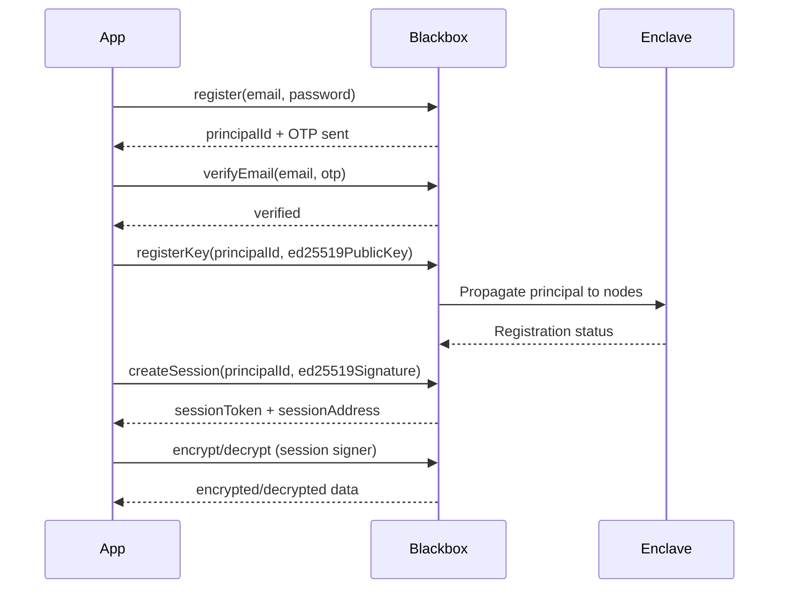

# Authentication & Sessions

Learn how to register, authenticate, and manage sessions for CIFER Web2 mode.

## Overview

The `web2` namespace enables email + password registration for CIFER, removing the requirement for a blockchain wallet. This is ideal for:

- Server-side applications and backend services
- Traditional web apps that don't use wallets
- TEE (Trusted Execution Environment) integrations
- Onboarding users who aren't familiar with Web3

Under the hood, Web2 mode uses the same blackbox encryption pipeline as Web3 mode, but replaces wallet-based signing with **session-based signing** using ephemeral EOA keypairs.



### Web2 vs Web3

| Feature | Web3 | Web2 |
|---------|------|------|
| **Auth** | EIP-1193 wallet (MetaMask, etc.) | Email + password + Ed25519 key |
| **Chain ID** | Real chain ID (e.g. 752025) | `WEB2_CHAIN_ID = -1` (sentinel) |
| **Block freshness** | RPC `eth_blockNumber` | `Date.now()` (millisecond timestamp) |
| **Signer** | Wallet `personal_sign` | Session EOA `personal_sign` |
| **Secret creation** | On-chain transaction | `POST /web2/secret` API call |

## Web2 Client (Recommended)

The `web2.createClient()` factory creates a client that stores your `session`, `blackboxUrl`, and `readClient` internally. Once a session is created, all subsequent calls use it automatically — no need to pass `session` and `blackboxUrl` on every call.

```typescript
import { createCiferSdk, web2 } from 'cifer-sdk';

const sdk = await createCiferSdk({ blackboxUrl: 'https://blackbox.cifersecurity.com:3010' });

// Create a client with stored defaults
const client = web2.createClient({
  blackboxUrl: sdk.blackboxUrl,
  readClient: sdk.readClient,
});

// Session is auto-stored after creation
await client.createManagedSession({
  principalId: 'your-principal-uuid',
  ed25519Signer: myEd25519Signer,
});

// All subsequent calls use the stored session automatically
const secret = await client.createSecret();
const encrypted = await client.payload.encryptPayload({
  secretId: secret.secretId,
  plaintext: 'Hello Web2!',
});
```

### Per-Call Overrides

Every client method accepts optional overrides for `session`, `blackboxUrl`, and `readClient`:

```typescript
// Use a different session for this one call
const secret = await client.createSecret({
  session: anotherSession,
});

// Override blackboxUrl for this call
const secret2 = await client.createSecret({
  blackboxUrl: 'https://other-blackbox.example.com:3010',
});
```

### Manual Session Management

You can also set the session manually:

```typescript
// Set session from external source
const session = web2.session.useExistingSessionKey({
  sessionPrivateKey: '0xabc123...',
});
client.setSession(session);
```

:::tip Stateless API
The original stateless `web2.*` functions (`web2.secret.createSecret()`, `web2.blackbox.payload.encryptPayload()`, etc.) remain available. Use them when you need full control or are managing multiple sessions.
:::

## Registration Flow

Registration is a three-phase process.

### Phase 1: Register with Email

```typescript
import { web2 } from 'cifer-sdk';

const result = await web2.auth.register({
  email: 'user@example.com',
  password: 'securePassword123',
  blackboxUrl: 'https://blackbox.cifersecurity.com:3010',
});

console.log('Principal ID:', result.principalId);
// An OTP has been sent to the email
```

### Phase 2: Verify Email

```typescript
const verified = await web2.auth.verifyEmail({
  email: 'user@example.com',
  otp: '123456', // OTP from email
  blackboxUrl: 'https://blackbox.cifersecurity.com:3010',
});

console.log('Verified:', verified.emailVerified);
```

:::tip Resend OTP
If the OTP expires or wasn't received, call `web2.auth.resendOtp()`. There is a 60-second cooldown between requests.
:::

### Phase 3: Register Ed25519 Key

After verification, register an Ed25519 public key. This key is propagated to all enclave cluster nodes and is used to authenticate session creation.

```typescript
const keyResult = await web2.auth.registerKey({
  principalId: result.principalId,
  password: 'securePassword123',
  ed25519Signer: myEd25519Signer,
  blackboxUrl: 'https://blackbox.cifersecurity.com:3010',
});

if (keyResult.nodeRegistrationStatus !== 'complete') {
  // Some nodes failed -- retry
  await web2.auth.retryNodeRegistration({
    principalId: keyResult.principalId,
    blackboxUrl: 'https://blackbox.cifersecurity.com:3010',
  });
}
```

## Ed25519 Signer Setup

The SDK uses a **bring-your-own-library** pattern for Ed25519 signing. You provide an object implementing the `Ed25519Signer` interface:

```typescript
interface Ed25519Signer {
  sign(message: Uint8Array): Promise<Uint8Array>;
  getPublicKey(): Uint8Array;
}
```

### Using @noble/ed25519

```bash
npm install @noble/ed25519
```

```typescript
import * as ed from '@noble/ed25519';

// Generate or load your Ed25519 private key
const privateKey = ed.utils.randomPrivateKey();
const publicKey = await ed.getPublicKeyAsync(privateKey);

const ed25519Signer = {
  async sign(message: Uint8Array): Promise<Uint8Array> {
    return ed.signAsync(message, privateKey);
  },
  getPublicKey(): Uint8Array {
    return publicKey;
  },
};
```

### Using Node.js crypto

```typescript
import { createPrivateKey, createPublicKey, sign } from 'crypto';

// Generate an Ed25519 keypair
const { privateKey, publicKey } = crypto.generateKeyPairSync('ed25519');

const ed25519Signer = {
  async sign(message: Uint8Array): Promise<Uint8Array> {
    const sig = sign(null, Buffer.from(message), privateKey);
    return new Uint8Array(sig);
  },
  getPublicKey(): Uint8Array {
    // Export raw 32-byte public key
    const raw = publicKey.export({ type: 'spki', format: 'der' });
    return new Uint8Array(raw.slice(-32));
  },
};
```

## Session Management

Sessions authenticate blackbox API calls. The SDK provides two modes.

### Managed Sessions (Recommended)

The SDK generates an ephemeral EOA keypair, authenticates via your Ed25519 key, and handles renewal automatically.

```typescript
const session = await web2.session.createManagedSession({
  principalId: 'your-principal-uuid',
  ed25519Signer: myEd25519Signer,
  blackboxUrl: 'https://blackbox.cifersecurity.com:3010',
  ttl: 900, // Optional: session TTL in seconds (default: 15 min)
});

console.log('Session address:', session.sessionAddress);
console.log('Expires at:', session.expiresAt);
```

**Key properties of managed sessions:**

- `session.signer` -- The ephemeral EOA signer (used automatically by wrappers)
- `session.ensureValid()` -- Checks expiry with 60s skew, auto-renews if needed
- `session.renew()` -- Force-renew the session
- `session.isManaged` -- Always `true`

### Existing Session Key

For advanced use cases (e.g. TEE web front) where a session was already created externally:

```typescript
const session = web2.session.useExistingSessionKey({
  sessionPrivateKey: '0xabc123...', // Hex-encoded secp256k1 private key
  principalId: 'your-principal-uuid', // Optional
});
```

:::warning Cannot Renew
Sessions created with `useExistingSessionKey` cannot renew. Calling `session.renew()` will throw a `Web2SessionError`. The session must be recreated externally when it expires.
:::

## Verify Credentials (Web2 only)

Use `web2.auth.verifyCredentials()` to confirm that a user entered the correct email and password. This is **Web2 only** (`chainId = -1`) — it is not available for Web3 wallet authentication.

This endpoint does **not** create a session or return session tokens. Use it when another system needs to validate credentials before proceeding (e.g. app unlock, key rotation pre-check).

```typescript
import { web2 } from 'cifer-sdk';

// Web2 only — not for Web3 wallet users
const result = await web2.auth.verifyCredentials({
  email: 'user@example.com',
  password: 'securePassword123',
  blackboxUrl: 'https://blackbox.cifersecurity.com:3010',
});

console.log('Valid:', result.valid);           // true
console.log('Principal ID:', result.principalId);

// Wrong credentials throw Web2AuthError (401/403/404)
```

After credentials are confirmed, create a session separately with `web2.session.createManagedSession()`.

## Password Reset

```typescript
// Step 1: Request a reset OTP (60s cooldown)
await web2.auth.forgotPassword({
  email: 'user@example.com',
  blackboxUrl: 'https://blackbox.cifersecurity.com:3010',
});

// Step 2: Reset password with the OTP
await web2.auth.resetPassword({
  email: 'user@example.com',
  otp: '654321',
  newPassword: 'newSecurePassword456',
  blackboxUrl: 'https://blackbox.cifersecurity.com:3010',
});
```

## Error Handling

```typescript
import {
  Web2Error,
  Web2SessionError,
  Web2AuthError,
  isWeb2Error,
  isWeb2SessionError,
  isCiferError,
} from 'cifer-sdk';

try {
  await web2.auth.register({ ... });
} catch (error) {
  if (isWeb2SessionError(error)) {
    // Session expired or cannot be renewed
    console.log('Session error:', error.message);
    // Re-create the session
  } else if (error instanceof Web2AuthError) {
    // Registration, OTP, or password error
    console.log('Auth error:', error.message);
  } else if (isWeb2Error(error)) {
    // Generic Web2 error
    console.log('Web2 error:', error.code, error.message);
  } else if (isCiferError(error)) {
    // Any other CIFER SDK error
    console.log('CIFER error:', error.code, error.message);
  }
}
```

## Best Practices

1. **Use the Web2 Client** - Prefer `web2.createClient()` over individual stateless functions. The client stores your session and defaults, reducing boilerplate.
2. **Secure Your Ed25519 Key** - Store Ed25519 private keys securely (e.g. environment variables, HSMs, or secret managers). Never expose them in client-side code.
3. **Use Managed Sessions** - Prefer `createManagedSession()` over `useExistingSessionKey()` for automatic renewal and simpler lifecycle management.
4. **Let `ensureValid()` Handle Renewal** - The `web2.blackbox.*` wrappers and the Web2 client call `session.ensureValid()` automatically before each request.
5. **Handle Node Registration Failures** - After `registerKey()`, check `nodeRegistrationStatus`. If it's not `'complete'`, use `retryNodeRegistration()` to retry failed nodes.
6. **Respect Rate Limits** - `resendOtp()` and `forgotPassword()` have a 60-second cooldown.

## Next Steps

- [Secret Management (Web2)](/docs/guides/web2/secret-management) - Create and manage secrets
- [Text Encryption (Web2)](/docs/guides/web2/text-encryption) - Encrypt and decrypt text payloads
- [File Encryption (Web2)](/docs/guides/web2/file-encryption) - Encrypt and decrypt large files
- [Quick Start (Web2)](/docs/getting-started/quick-start-web2) - Concise end-to-end walkthrough
