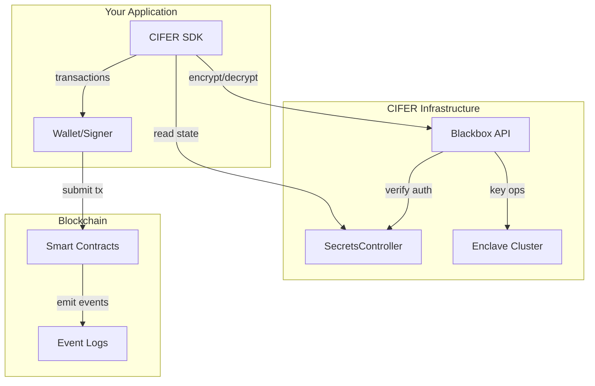

# Introduction

Welcome to the **CIFER SDK** documentation. CIFER (Cryptographic Infrastructure for Encrypted Records) provides quantum-resistant encryption for blockchain applications using ML-KEM-768 key encapsulation and AES-GCM symmetric encryption.

:::tip Using AI Assistants?
Point your AI agent (ChatGPT, Claude, Cursor, etc.) to [`llm.txt`](/llm.txt) — a comprehensive plaintext reference designed for AI consumption. This helps agents understand the SDK and implement features more accurately.
:::

## What is CIFER?

CIFER is a decentralized encryption infrastructure that enables:

- **Quantum-resistant encryption** using ML-KEM-768 (NIST-standardized lattice-based cryptography)
- **On-chain secret management** with ownership and delegation controls
- **Secure key storage** in enclave clusters with threshold key sharing
- **Encrypted data commitments** stored on-chain with log-based retrieval

## SDK Features

The `cifer-sdk` provides a complete toolkit for integrating CIFER into your applications:

| Feature | Description |
|---------|-------------|
| **Wallet Agnostic** | Works with any EIP-1193 provider (MetaMask, WalletConnect, etc.) |
| **Zero Dependencies** | No runtime dependencies on ethers, viem, or wagmi |
| **Transaction Intents** | You control transaction execution |
| **Multi-chain Support** | Automatic discovery of supported chains |
| **File Encryption** | Async job system for large files |
| **On-chain Commitments** | Log-based encrypted data storage |
| **High-level Flows** | Orchestrated operations for common use cases |

## Architecture Overview



## Quick Example

```typescript
import { createCiferSdk, Eip1193SignerAdapter, blackbox } from 'cifer-sdk';

// Initialize SDK with auto-discovery
const sdk = await createCiferSdk({
  blackboxUrl: 'https://cifer-blackbox.ternoa.dev:3010.network',
});

// Connect wallet
const signer = new Eip1193SignerAdapter(window.ethereum);

// Encrypt data
const encrypted = await blackbox.payload.encryptPayload({
  chainId: 752025,
  secretId: 123n,
  plaintext: 'Hello, quantum-resistant world!',
  signer,
  readClient: sdk.readClient,
  blackboxUrl: sdk.blackboxUrl,
});

console.log('Encrypted:', encrypted.cifer);
```

## Next Steps

- [Installation](/docs/getting-started/installation) - Add the SDK to your project
- [Quick Start](/docs/getting-started/quick-start) - Get up and running in 5 minutes
- [Core Concepts](/docs/getting-started/concepts) - Understand secrets, delegation, and encryption
- [API Reference](/docs/api) - Complete API documentation
