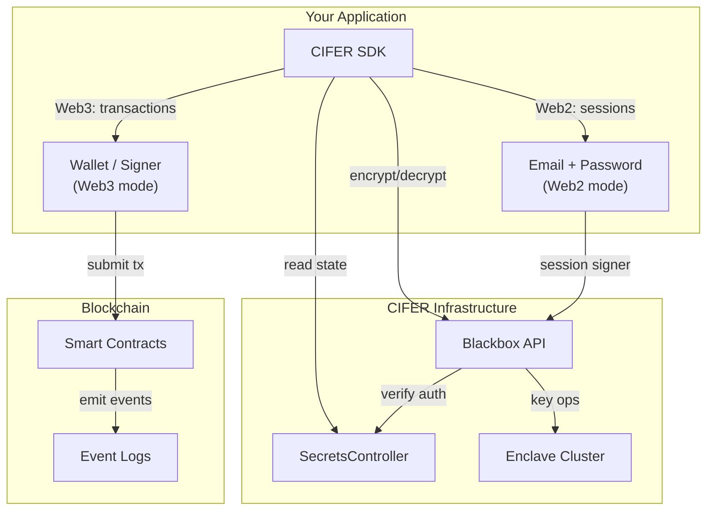

# Introduction

Welcome to the **CIFER SDK** documentation. CIFER (Cryptographic Infrastructure for Encrypted Records) provides quantum-resistant encryption using ML-KEM-768 key encapsulation and AES-GCM symmetric encryption.

:::tip Using AI Assistants?
Point your AI agent (ChatGPT, Claude, Cursor, etc.) to [`llm.txt`](/llm.txt) — a comprehensive plaintext reference designed for AI consumption. This helps agents understand the SDK and implement features more accurately.
:::

## What is CIFER?

CIFER is a decentralized encryption infrastructure that enables:

- **Quantum-resistant encryption** using ML-KEM-768 (NIST-standardized lattice-based cryptography)
- **On-chain secret management** with ownership and delegation controls
- **Secure key storage** in enclave clusters with threshold key sharing
- **Encrypted data commitments** stored on-chain with log-based retrieval

## SDK Features

The `cifer-sdk` provides a complete toolkit for integrating CIFER into your applications:

| Feature | Description |
|---------|-------------|
| **Wallet Agnostic** | Works with any EIP-1193 provider (MetaMask, WalletConnect, etc.) |
| **Web2 Support** | Email + password auth with session-based encryption (no wallet needed) |
| **Zero Dependencies** | No runtime dependencies on ethers, viem, or wagmi |
| **Transaction Intents** | You control transaction execution |
| **Multi-chain Support** | Automatic discovery of supported chains |
| **File Encryption** | Async job system for large files |
| **On-chain Commitments** | Log-based encrypted data storage |
| **High-level Flows** | Orchestrated operations for common use cases |

## Choose Your Path

CIFER supports two integration modes. Choose the one that fits your application:

:::info Web3 — Blockchain / Wallet-Based
Best for **dApps and on-chain applications**. Users authenticate with a blockchain wallet (MetaMask, WalletConnect, etc.). Secrets are created via on-chain transactions, and you get full access to on-chain commitments and multi-chain support.

**[Quick Start (Web3) →](/docs/getting-started/quick-start)**
:::

:::info Web2 — Email + Password / Traditional
Best for **server-side apps, backends, and traditional web apps** that don't use wallets. Users register with email + password, authenticate via Ed25519-signed sessions, and manage secrets through API calls — no blockchain interaction required.

**[Quick Start (Web2) →](/docs/getting-started/quick-start-web2)**
:::

Both modes use the **same quantum-resistant encryption pipeline** (ML-KEM-768 + AES-GCM) under the hood. The only difference is how users authenticate and how secrets are managed.

## Architecture Overview


```mermaid
graph TB
    subgraph app [Your Application]
        SDK[CIFER SDK]
        Wallet["Wallet / Signer\n(Web3 mode)"]
        Web2Auth["Email + Password\n(Web2 mode)"]
    end
    
    subgraph cifer [CIFER Infrastructure]
        Blackbox[Blackbox API]
        Controller[SecretsController]
        Enclave[Enclave Cluster]
    end
    
    subgraph chain [Blockchain]
        SC[Smart Contracts]
        Logs[Event Logs]
    end
    
    SDK --> |encrypt/decrypt| Blackbox
    SDK --> |read state| Controller
    SDK --> |"Web3: transactions"| Wallet
    SDK --> |"Web2: sessions"| Web2Auth
    Web2Auth --> |session signer| Blackbox
    Wallet --> |submit tx| SC
    Blackbox --> |verify auth| Controller
    Blackbox --> |key ops| Enclave
    SC --> |emit events| Logs
```

## Quick Examples

### Web3 (Wallet)

```typescript
import { createCiferSdk, Eip1193SignerAdapter, blackbox } from 'cifer-sdk';

const sdk = await createCiferSdk({
  blackboxUrl: 'https://cifer-blackbox.ternoa.dev:3010',
});
const signer = new Eip1193SignerAdapter(window.ethereum);

const encrypted = await blackbox.payload.encryptPayload({
  chainId: 752025,
  secretId: 123n,
  plaintext: 'Hello, quantum-resistant world!',
  signer,
  readClient: sdk.readClient,
  blackboxUrl: sdk.blackboxUrl,
});
```

### Web2 (Email + Password)

```typescript
import { createCiferSdk, web2 } from 'cifer-sdk';

const sdk = await createCiferSdk({
  blackboxUrl: 'https://cifer-blackbox.ternoa.dev:3010',
});

// Create a client — stores session & defaults automatically
const client = web2.createClient({
  blackboxUrl: sdk.blackboxUrl,
  readClient: sdk.readClient,
});

// Session is auto-stored after creation
await client.createManagedSession({
  principalId: 'your-principal-uuid',
  ed25519Signer: myEd25519Signer,
});

// No need to pass session or blackboxUrl!
const encrypted = await client.payload.encryptPayload({
  secretId: 42,
  plaintext: 'Hello, quantum-resistant world!',
});
```

## Next Steps

- [Installation](/docs/getting-started/installation) - Add the SDK to your project
- [Quick Start (Web3)](/docs/getting-started/quick-start) - Get up and running with wallet-based encryption
- [Quick Start (Web2)](/docs/getting-started/quick-start-web2) - Get up and running with email + password
- [Core Concepts](/docs/getting-started/concepts) - Understand secrets, delegation, and encryption
- [API Reference](/docs/api) - Complete API documentation
